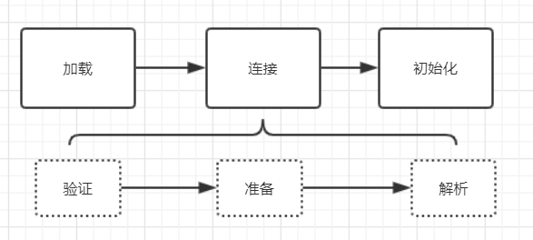

<!-- TOC -->

- [JVM概念的理解](#jvm概念的理解)
- [虚拟机的启动时机](#虚拟机的启动时机)
- [类加载机制](#类加载机制)
  - [加载](#加载)
  - [验证](#验证)
  - [准备](#准备)
  - [解析](#解析)
  - [初始化](#初始化)

<!-- /TOC -->

# JVM概念的理解
> JVM是Java Virtual Machine（Java虚拟机）的缩写，是通过在实际的计算机上仿真模拟各种计算机功能来实现的。由一套字节码指令集、一组寄存器、一个栈、一个垃圾回收堆和一个存储方法域等组成。JVM屏蔽了与操作系统平台相关的信息，使得Java程序只需要生成在Java虚拟机上运行的目标代码（字节码），就可在多种平台上不加修改的运行，这也是Java能够“一次编译，到处运行的”原因。JVM的这种解决方案按照现在的说法，可以称为容器了，比如现在流行的docker容器技术。

*Java的设计是运行在JVM的环境下的，Java的设计和C/C++有不同之处的一个地方就是内存的释放，C/C++是需要在程序中手动进行内存释放，而Java的设计把这块的工作交给了JVM，所以程序的开发过程中就可以把精力放在更应该关注的地方，但是，如果对JVM了解不深刻，那么在JVM出现内存溢出/泄露问题的时候，我们将束手无策。*

# 虚拟机的启动时机
发现网上的一段话描述的不错，直接引用在这里：
> 一个运行时的Java虚拟机实例的天职是：负责运行一个java程序。当启动一个Java程序时，一个虚拟机实例也就诞生了。当该程序关闭退出，这个虚拟机实例也就随之消亡。如果同一台计算机上同时运行三个Java程序，将得到三个Java虚拟机实例。每个Java程序都运行于它自己的Java虚拟机实例中。
Java虚拟机实例通过调用某个初始类的main()方法来运行一个Java程序。而这个main()方法必须是共有的(public)、静态的(static)、返回值为void，并且接受一个字符串数组作为参数。任何拥有这样一个main()方法的类都可以作为Java程序运行的起点。

# 类加载机制
在开发中.java文件是需要先编译解释成.class文件，才能被JVM加载到内存中然后进行执行的。而在Java这种面向对象的语言中，这些.class文件加载到内存中后统一也是有一层抽象`Class`对象。这些在使用java的反射技术时可能需要了解的比较清楚。
JVM加载类的过程分为3步：**加载->连接->初始化**

## 加载
类的加载过程主要完成以下几件事情：
1. 通过全类名获取定义此类的二进制字节流
2. 将字节流所代表的静态存储结构转换成方法区运行时数据结构
3. 在内存中生成一个代表该类的Class对象，作为方法区这些数据的访问入口

## 验证
验证这一过程，主要验证文件格式、元数据格式、字节码验证等等。

## 准备
为类变量（static）修饰的变量分配内存空间，并赋初始化值。这里注意的是，由`static final`修饰的变量则是直接初始化完成。实例变量在这里并不会分配内存空间，而是随着实例对象的创建在堆内存中创建。

## 解析
解析阶段是虚拟机将常量池内的符号引用替换为直接引用的过程。符号引用就是一组符号来描述目标，可以是任何字面量；直接引用就是直接指向目标的指针、相对偏移量或一个间接定位到目标的句柄。

## 初始化
初始化是指为类的静态变量赋予正确的初始值，JVM负责对类进行初始化，主要对类变量进行初始化。在Java中对类变量进行初始值设定有两种方式:  
（1）声明类变量时指定初始值；  
（2）使用静态代码块为类变量指定初始值。

**类的加载时机**
- 创建类的实例，也就是new一个对象  
- 访问某个类或接口的静态变量，或者对该静态变量赋值  
- 调用类的静态方法  
- 反射（Class.forName("com.xxxx.Test")）  
- 初始化一个类的子类（会首先初始化子类的父类）  
- JVM启动时标明的启动类，即文件名和类名相同的那个类 

**类加载器**
（1）根类加载器  （2）扩展类加载器  （3）系统类加载器  

**类加载机制**
（1）全盘负责  （2）双亲委派模型  （3）缓存机制