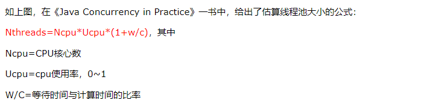

<!-- TOC -->

- [计算机核心数和线程数的计算关系](#计算机核心数和线程数的计算关系)
- [Java中创建异步任务的几种方法（创建线程的方法）](#java中创建异步任务的几种方法创建线程的方法)
- [Thread中的`run()`和`start()`的区别](#thread中的run和start的区别)
- [线程的阻塞](#线程的阻塞)
- [线程池](#线程池)
  - [Java中几种创建线程池的方法：](#java中几种创建线程池的方法)
  - [`ThreadPoolExecutor`](#threadpoolexecutor)
  - [线程池都提供了`submit()`和`execute()`方法](#线程池都提供了submit和execute方法)
  - [ThreadPoolExecutor使用的阻塞队列](#threadpoolexecutor使用的阻塞队列)

<!-- /TOC -->

为什么并发是最常见的一种提高任务处理能力的手段，归根结底---为了充分利用计算机的计算能力。那么也就带来了最常见的几种问题：  
1. 线程数和计算机的核心数之间的关系，如何均衡，如何才能发挥计算最大的计算能力
2. 并发带来的内存数据安全问题 

# 计算机核心数和线程数的计算关系

`w/c`中的W(等待时间)---计算时间+（IO时间+...），c---计算时间，目前我在实际应用中碰到的使用多线程处理的地方都是IO比较密集的地方，比如数据库插入数据。这中就是比较耗时的操作，w/c的值就相对来说比较大。比如保存1K条数据，计算耗时5ms，IO耗时100ms，那W/C=(5+100)/5=21。如果是1核1线程的计算机就可以设置成22，如果是4核8线程可以设置成168.
当然这几公式里面的CPU都是按照1C1T来说的。

# Java中创建异步任务的几种方法（创建线程的方法）
- 实现`Runnable`
Runnable是一个函数接口，其中只有一个`run()`函数
- 继承`Thread`
Thread是一个类，也是实现了`Runnable`，其中包含了很多方法。所以采用这中方式也是相对于增加了开销.
- 使用线程池（一般在实际的开发中需要使用这种方式，方便对线程的统一管理）
```
public static void main(String[] args) {
    new Thread(new Thread1()).start();
    new Thread2().start();
}

static class Thread1 implements Runnable {
    @Override
    public void run() {
        System.out.println("线程：" + Thread.currentThread().getName() + ", Thread1");
    }
}

static class Thread2 extends Thread {
    @Override
    public void run() {
        System.out.println("线程：" + Thread.currentThread().getName() + ", Thread2");
    }
}
```

# Thread中的`run()`和`start()`的区别
- `run()`: 只是在原线程中调用  
- `start()`: 创建了一个新线程，并且`start()`中实现了`run()`,所以也会启动新创建的这个线程。

# 线程的阻塞
- `sleep`  
使得线程在指定时间内进入阻塞状态，在这段时间内线程不能获得CPU执行时间片段，在超过这段时间后，线程重新进入可执行状态。

- `yield`  
使当前线程放弃执行当前获取到的CPU执行时间片段，但是线程仍旧处于可执行状态。

- `wait` 和 `notify`  
`wait`使得线程处于阻塞状态，有两种方式使线程处于阻塞状态：指定时间、不指定时间。
（1）当指定时间时：线程阻塞时间超过该时间，则解除阻塞处于可执行状态；或者使用`notify`唤醒线程处于可执行状态。  
（2）当不指定时间时：只能使用`notify`来唤醒

**`sleep`和`wait`的区别**  
（1）sleep使正在执行的线程，放弃CPU时间片，让其他的线程获取到该时间片得到执行的权利。并且sleep并不会释放同步资源锁。  
（2）wait指的是当前线程让自己暂时退让出同步资源锁，以便其他正在等待该资源的线程得到该资源进而运行。所以wait方法是只能在同步方法或者同步代码块中使用才有意义。只有同步方法或者同步代码块才有锁。  
（3）由于wait上述2的原因，wait本身设计中也是Object类中的方法，而sleep是Thread的方法。  

# 线程池

在使用多线程编程时，一般是需要使用到线程池的。使用线程池的好处有：（1）减少线程的频繁创建与销毁；（2）可以控制并发数量；

## Java中几种创建线程池的方法：
- `Executors.newFixedThreadPool`: 创建固定线程数的线程池
- `Executors.newSingleThreadExecutor`: 创建单任务线程
- `Executors.newCachedThreadPool`: 创建可变线程池，可根据需要创建新线程的线程池，但是在以前构造的线程可用时将重用它们。
- `Executors.newScheduledThreadPool`: 创建延迟连接池
- `ThreadPoolExecutor`
**弊端**
(1)`FixedThreadPool` 和 `SingleThreadExecutor` ： 允许请求的队列长度为 `Integer.MAX_VALUE` ，可能堆积大量的请求，从而导致OOM。    
(2)`CachedThreadPool` 和 `ScheduledThreadPool` ： 允许创建的线程数量为 `Integer.MAX_VALUE` ，可能会创建大量线程，从而导致OOM。

## `ThreadPoolExecutor`
由于以上的弊端在使用时我们建议使用`ThreadPoolExecutor`来创建线程池。它提供了几种构造方法，用来创建。

以上几种方法根据实际的使用场景来进行使用。比如线程数量是可控的，这种没什么问题。但是线程数量不可控，可能出现任务特别多的时候，就会有资源不可用出现异常的问题。在平时使用的时候，通常我们会考虑更好的方案。
java中提供的`ThreadPoolExecutor`类可以很好的解决这些一般常见的问题。`ThreadPoolExecutor`继承了`AbstractExecutorService`类，并提供了四个构造器，可以通过构造器来创建线程池。构造器中的几个参数如下：
- `corePoolSize`: 核心池的大小，默认线程池中的线程数为0，当创建了任务时才会创建新的线程。可以通过`prestartAllCoreThreads()`或者`prestartCoreThread()`方法初始化线程数为corePoolSize或者1个。
- `maximumPoolSize`: 线程池的最大线程数
- `keepAliveTime`: 空闲线程的存活时间
- `unit`: 存活时间单位
- `workQueue`: 阻塞队列
- `threadFactory`: 线程工厂
- `handler`: 拒绝任务的策略  
1）ThreadPoolExecutor.AbortPolicy:丢弃任务并抛出RejectedExecutionException异常。   
2）ThreadPoolExecutor.DiscardPolicy：也是丢弃任务，但是不抛出异常。   
3）ThreadPoolExecutor.DiscardOldestPolicy：丢弃队列最前面的任务，然后重新尝试执行任务（重复此过程）  
4）ThreadPoolExecutor.CallerRunsPolicy：由调用线程处理该任务
```
public static final ThreadPoolExecutor executor = new ThreadPoolExecutor(
    5,
    15,
    18000,
    TimeUnit.MILLISECONDS,
    new LinkedBlockingDeque<>(5000),
    new DefaultThreadFactory("view"),
    new ThreadPoolExecutor.CallerRunsPolicy());
```

## 线程池都提供了`submit()`和`execute()`方法
- `submit()`用来提交需要有返回值的任务，线程池会返回一个`Future`类型的对象，通过`Future`可以判断这个任务是否执行成功，并且可以使用`get()`函数来获取返回值，只是`get()`方法会阻塞当前线程直到任务完成。  
- `execute()`用来提交不需要返回值的任务

## ThreadPoolExecutor使用的阻塞队列

可以参考这篇文章: [https://blog.csdn.net/xiaojin21cen/article/details/87363143](https://blog.csdn.net/xiaojin21cen/article/details/87363143)

**在使用误解队列的时候一定要注意,一般情况下一定要给误解队列设置一个队列可以容纳的值,否则线程数最多只能达到corePoolSize的值**
